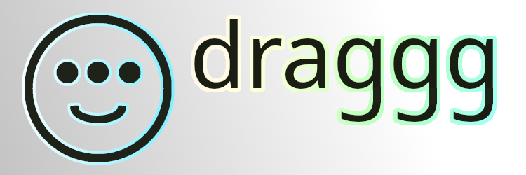

## Features

- **macOS-style three-finger drag**: Natural dragging gestures with three fingers
- **Intelligent finger tracking**: Weighted position tracking with leading finger emphasis
- **Multi-touchpad support**: Works with Apple trackpads and standard Linux touchpads
- **Automatic hardware detection**: Automatically finds and configures your touchpad
- **Customizable sensitivity**: Adjust drag sensitivity and movement thresholds
- **Left-handed support**: Configurable for left-handed users
- **Background service**: Optional systemd service for always-on operation
- **X11 compatible**: Works with X11 display server (recommended)

## How It Works: Finger Tracking and Offset Methods

### Index Finger Tracking Algorithm

draggg uses an intelligent weighted position tracking system that emphasizes the leading finger (typically the index finger) while incorporating input from all three fingers:

#### 1. **Leading Finger Identification**

The system identifies the "leading finger" based on hand orientation:
- **Right-handed users**: Leftmost finger (lowest X coordinate) - typically the index finger
- **Left-handed users**: Rightmost finger (highest X coordinate) - typically the index finger

This is determined by sorting all three finger positions by X coordinate and selecting the appropriate edge based on the `left_handed` configuration.

#### 2. **Weighted Position Calculation**

The tracking position is calculated using a weighted average:

```python
weighted_x = (leading_x × leading_weight + finger2_x × other_weight + finger3_x × other_weight) / total_weight
weighted_y = (leading_y × leading_weight + finger2_y × other_weight + finger3_y × other_weight) / total_weight
```

**Default weights:**
- Leading finger (index finger): **1.5** (50% more influence)
- Other two fingers: **0.3** each (30% combined influence)

This weighting scheme provides:
- **Smooth tracking**: The leading finger dominates, reducing jitter from fingers moving at slightly different rates
- **Natural feel**: Mimics single-finger cursor movement while maintaining three-finger gesture recognition
- **Stability**: Other fingers provide stabilizing input without overwhelming the primary tracking finger

#### 3. **Offset Calculation Method**

Once dragging begins, the system uses an offset-based approach to translate finger movement to cursor movement:

**Step 1: Initial Position Lock**
- When three fingers are detected, the system records:
  - Current cursor position (`cursor_lock_position`)
  - Initial weighted finger position (`initial_left_finger_position`)

**Step 2: Movement Offset Calculation**
For each frame during dragging:
```python
offset_x = current_finger_x - initial_finger_x
offset_y = current_finger_y - initial_finger_y
```

**Step 3: Cursor Position Update**
The offset is applied to the locked cursor position with sensitivity scaling:
```python
new_cursor_x = cursor_lock_position_x + (offset_x × drag_sensitivity)
new_cursor_y = cursor_lock_position_y + (offset_y × drag_sensitivity)
```

**Step 4: Relative Movement Emission**
The system calculates relative movement from the last position and emits it via uinput:
```python
dx = new_cursor_x - last_cursor_x
dy = new_cursor_y - last_cursor_y
```

This dual-mode approach ensures:
- **Absolute positioning**: When cursor position is available (via xdotool/X11), provides precise control
- **Relative fallback**: When cursor position is unavailable, uses pure relative movement for compatibility

#### 4. **State Machine Flow**

The gesture recognition follows this state progression:

1. **IDLE**: No gesture active
2. **THREE_FINGER_DETECTED**: Three fingers detected, starting 50ms detection delay
3. **LOCKING_POSITIONS**: Delay elapsed, locking cursor and finger positions
4. **WAITING_FOR_THRESHOLD**: Waiting for movement to exceed threshold (default: 10 pixels)
5. **DRAGGING**: Actively dragging, tracking finger movement and updating cursor
6. **RELEASING**: Fingers lifted, waiting 30ms before releasing mouse button
7. **IDLE**: Back to idle state

#### 5. **Micro-Delays for Stability**

The system includes small delays to prevent accidental activations:
- **Detection delay (50ms)**: Prevents activation from brief three-finger touches
- **Click delay (20ms)**: Small delay before mouse button press for stability
- **Release delay (30ms)**: Prevents premature release during finger adjustments

### Why This Approach Works

1. **Leading Finger Emphasis**: By giving the index finger (leading finger) more weight, the system tracks the finger that users naturally use to guide movement, resulting in intuitive control.

2. **Offset-Based Movement**: Using offsets from an initial position rather than absolute positions prevents cursor jumps and provides smooth, predictable movement.

3. **Sensitivity Scaling**: The `drag_sensitivity` parameter (default 0.25) allows fine-tuning of movement responsiveness, making it adaptable to different touchpad sizes and user preferences.

4. **Weighted Averaging**: Incorporating all three fingers while emphasizing the leading finger provides stability without sacrificing responsiveness.
